#  Project 1: Hosting a Secure Static Website with Amazon S3 and CloudFront

##  Project Overview

In this project, I demonstrate how I hosted a static website using **Amazon S3** and secured it with **CloudFront**.

The goal was to:

- Keep the S3 bucket **private**
- Enable **secure HTTPS access**
- Use **CloudFront as a secure entry point**
- Follow production-style architecture principles

Final Architecture:
User → CloudFront (HTTPS) → Private S3 Bucket

---

# Step 1: Creating and Configuring the S3 Bucket

I logged into the AWS Management Console and searched for **Amazon S3**.

Before creating the bucket, I carefully selected the region based on:

- Compliance considerations  
- Pricing  
- Service availability  
- Proximity  

For this project, I selected:

US East (N. Virginia) – us-east-1

Since this is a learning project, region selection was flexible.

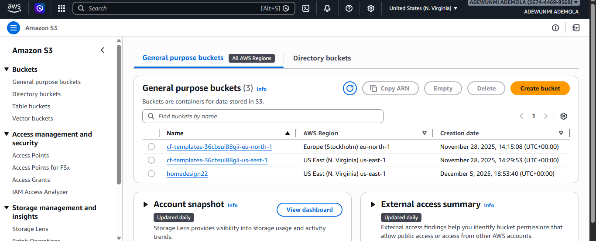

## Bucket Naming

S3 bucket names must be **globally unique**.

My first attempt:

website-site-2026

It failed because the name already existed globally.

I then used:

ademola-site-2026

And it was successfully created.

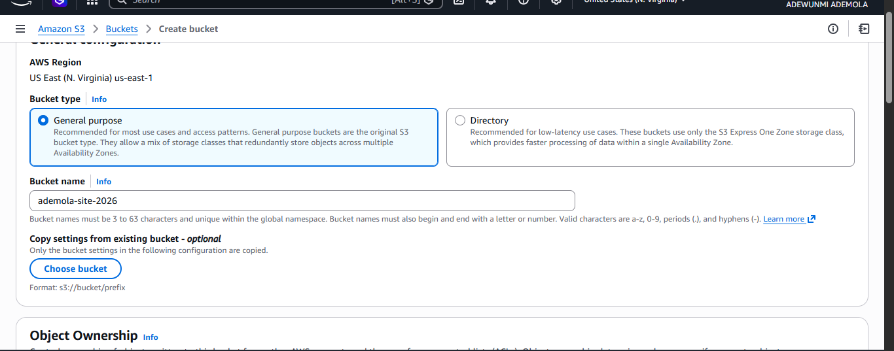

---

## Security Configuration

While configuring the bucket:

- I made sure Block Public Access was enabled.

- I did NOT allow public access to the bucket.

This is important because:

If public access is enabled, anyone on the internet could access the files, which could lead to data exposure if sensitive files are stored.

Although S3 can be made public for static websites, I intentionally kept it private because I planned to use CloudFront for secure access.

The rest of the settings were left as default.

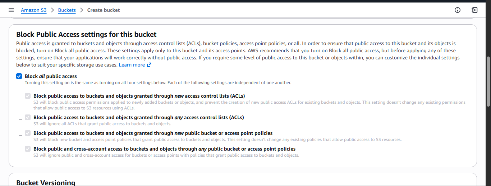

---

# Step 2: Uploading Website Files

After creating the bucket:

- I navigated to the bucket

- Clicked on the Objects tab

- Uploaded my website file

My entry file was:

index.html

Once the upload was complete, I went to the Properties section and enabled Static Website Hosting.

Even though the bucket remains private, enabling static hosting helps define the entry file.

I set:

index.html

as the default entry file.

I then confirmed in the Permissions tab that Block Public Access was still enabled.

At this point, the S3 bucket configuration was complete.

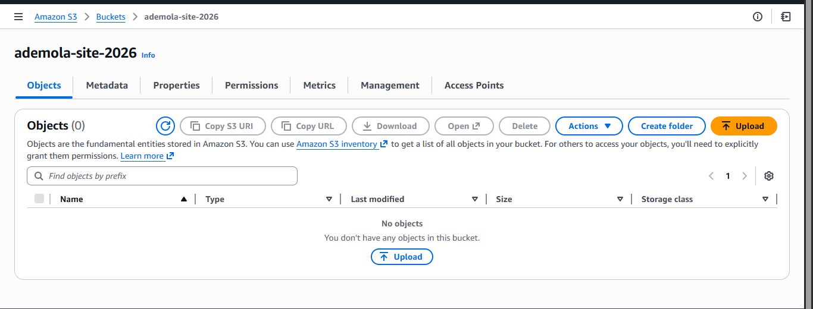
step
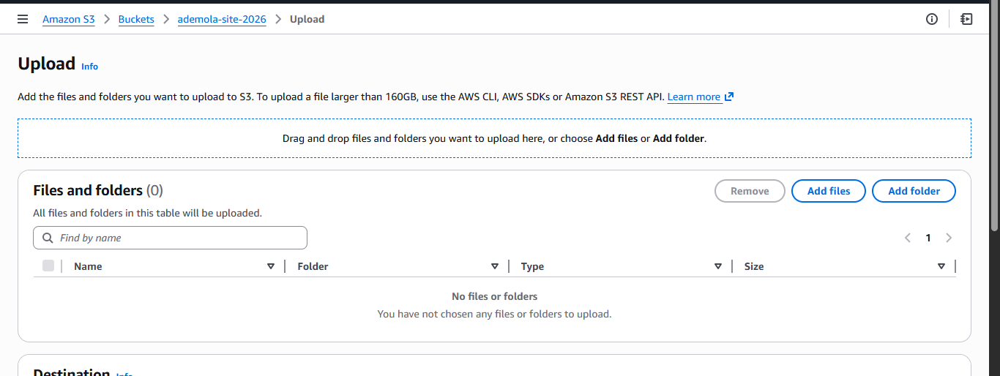
step
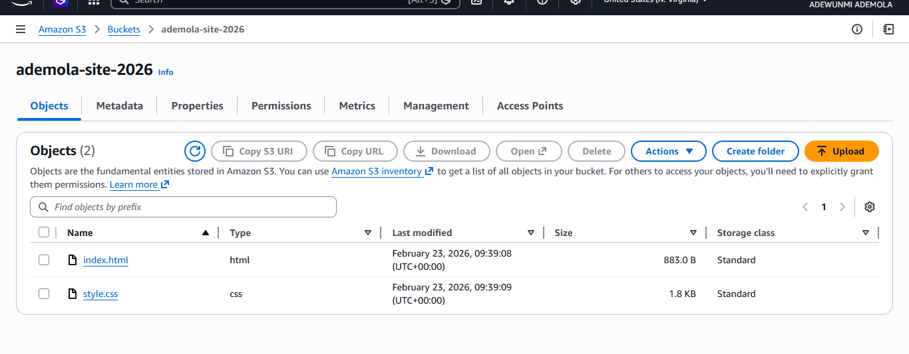
step
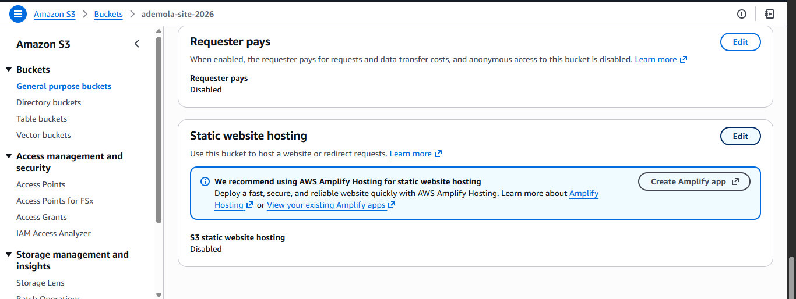
step
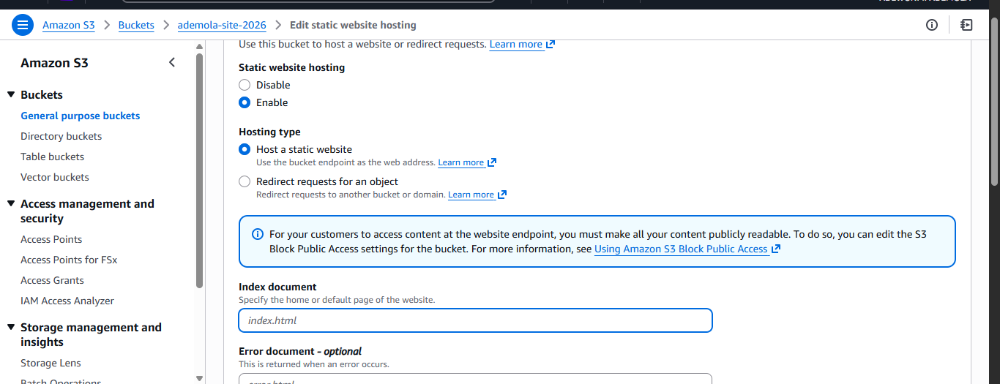
step
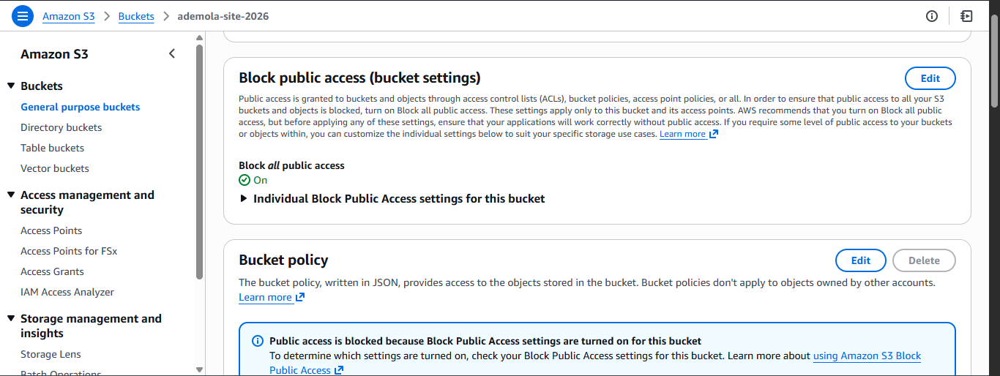

---

#  Step 3: Setting Up CloudFront

Next, I searched for **CloudFront** in the AWS Management Console.

CloudFront acts as:

- A Content Delivery Network (CDN)
- A secure layer between users and S3
- An HTTPS enforcement process
- A performance optimization service
  
  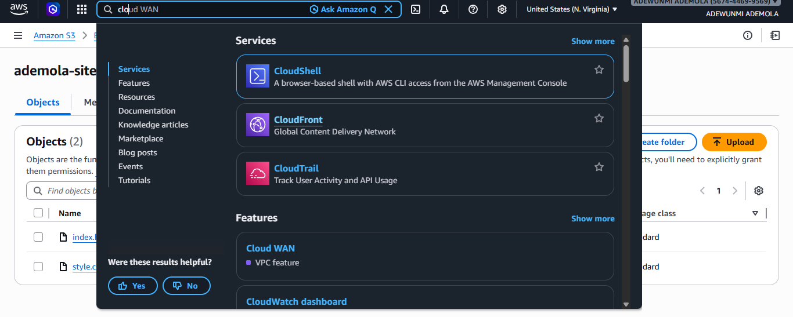
---

# Creating the Distribution

- I clicked Create Distribution.
- I give it a name
- In the Origin section, I selected my S3 bucket (not the S3 website endpoint).
- The origin is simply where the content lives — in this case, my S3 bucket.
  
  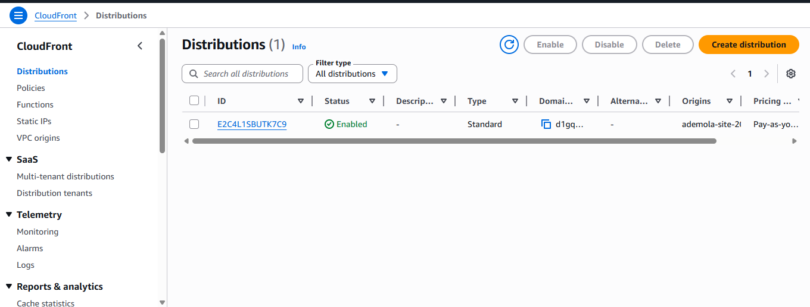

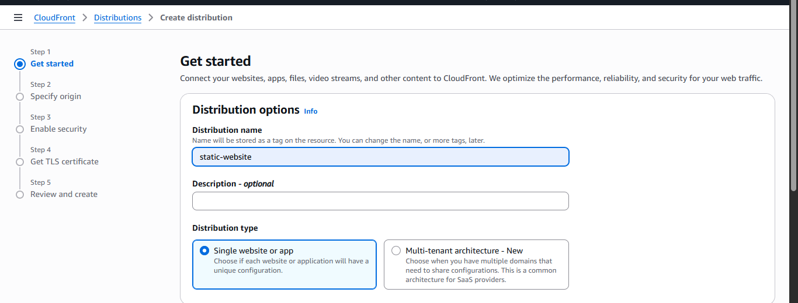

step

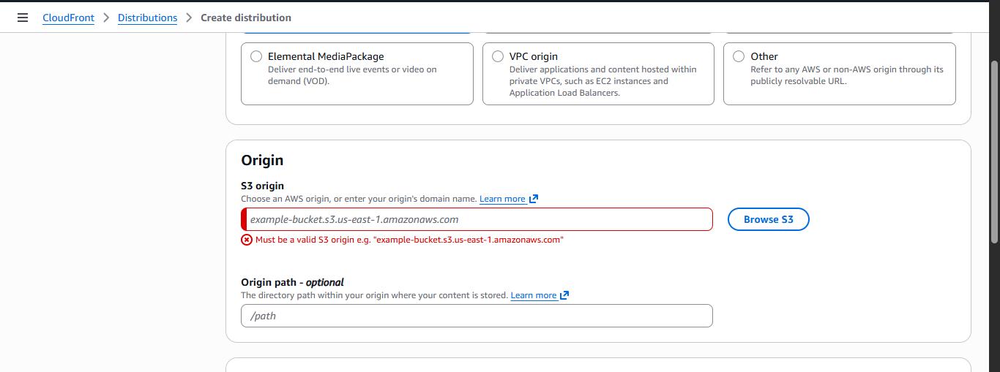

# DDoS Protection Note 

CloudFront automatically integrates with AWS Shield Standard, which provides protection against common DDoS attacks.

In simple terms:

A DDoS attack is when attackers overwhelm a server with massive traffic, potentially causing downtime or financial loss.

CloudFront helps reduce this risk.

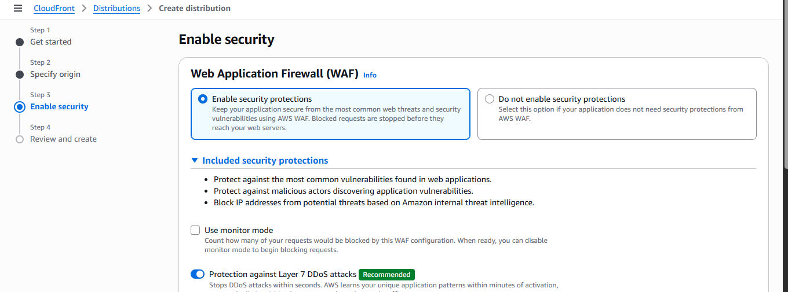

Final review configurations 

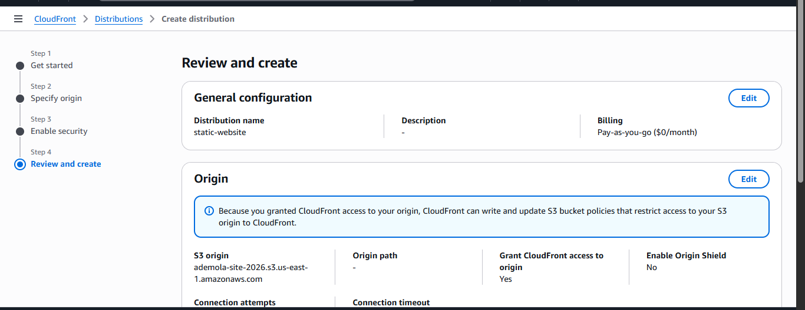

---

# Step 4: Deployment and Manual Bucket Policy 

After reviewing all configurations, I created the CloudFront distribution.

The initial status showed:

Deploying

After a few minutes, it changed to:

Deployed

At this point, CloudFront had generated the distribution successfully, but because my S3 bucket was private and Block Public Access was enabled, CloudFront needed permission to access it.

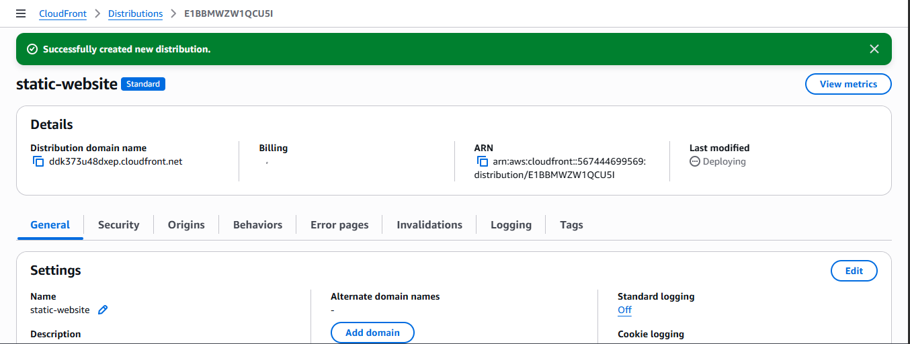

---

## Manual Bucket Policy Update (What I Did)

In my setup, I manually copied the bucket policy generated for CloudFront under origin and pasted it into my S3 bucket permissions section.

I navigated to:

S3 → My Bucket → Permissions → Bucket Policy

Then I pasted the policy that allows CloudFront to access only this specific bucket.

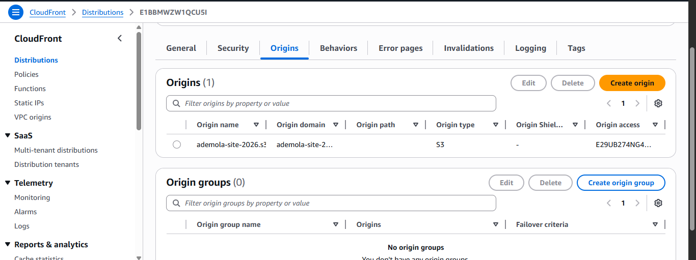

step
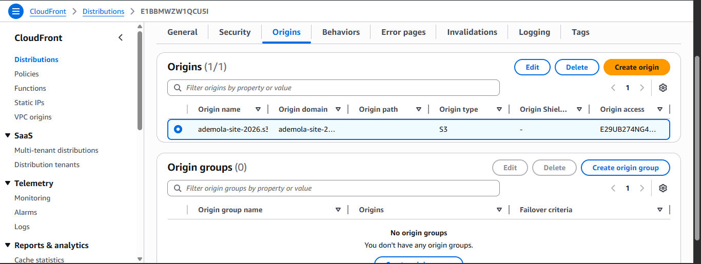

step

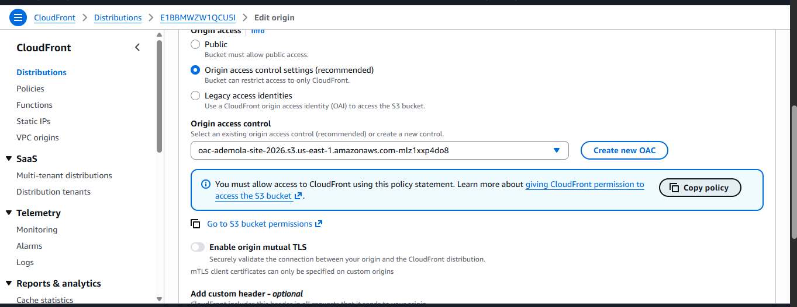

This policy ensures:

- The bucket remains private

- Only this specific CloudFront distribution can access it

- No public access is granted

After saving the policy, CloudFront was able to retrieve objects from the bucket.

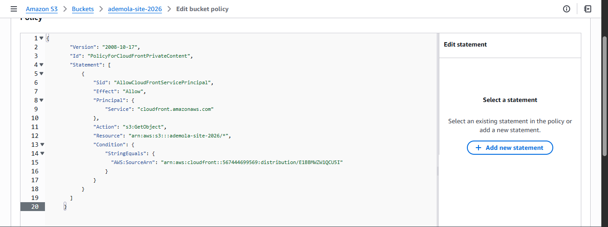

---

## What I Learned 

Later, I learned that if Origin Access Control (OAC) is configured properly during distribution setup, CloudFront can automatically update the bucket policy for you.

In a standard secure production setup:

You enable OAC

Select Allow private S3 bucket access to CloudFront

AWS automatically attaches the correct bucket policy

Manual updates are usually not required when OAC is configured correctly.

---

## Why I Kept This Manual Step

I documented this manual process intentionally because:

It helped me understand how bucket policies work

It showed me how CloudFront is granted access

Understanding the policy structure is important, especially for me and anybody moving toward Aws Cloud Security.

---

# Step 5: Accessing the Website

CloudFront generated a domain name :

I copied the domain name and opened it in a new browser tab. (Distribuction domain name )

I appended:

/index.html

The website displayed successfully.

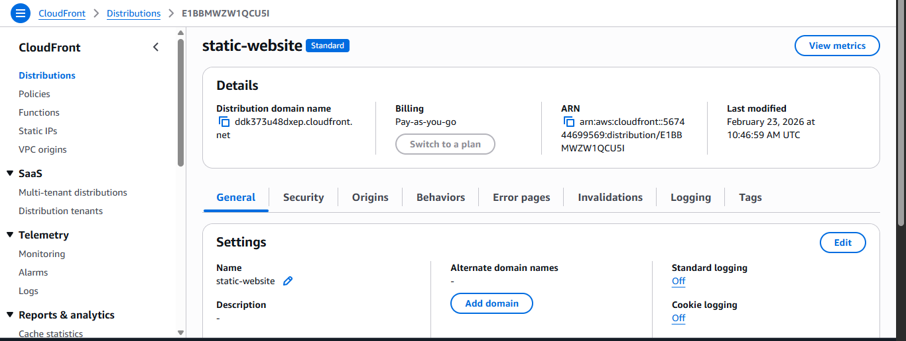
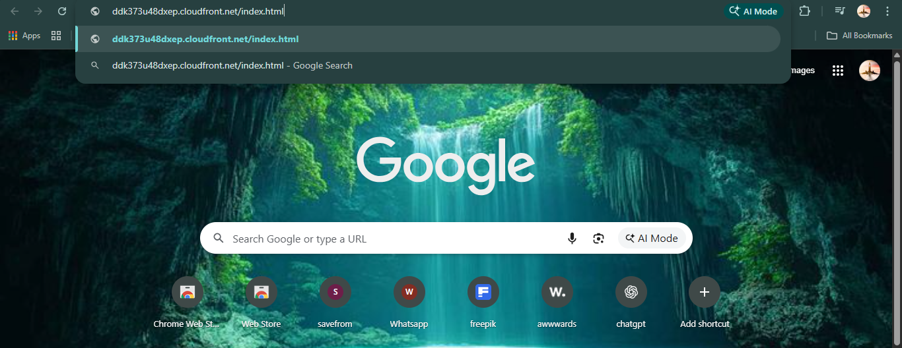
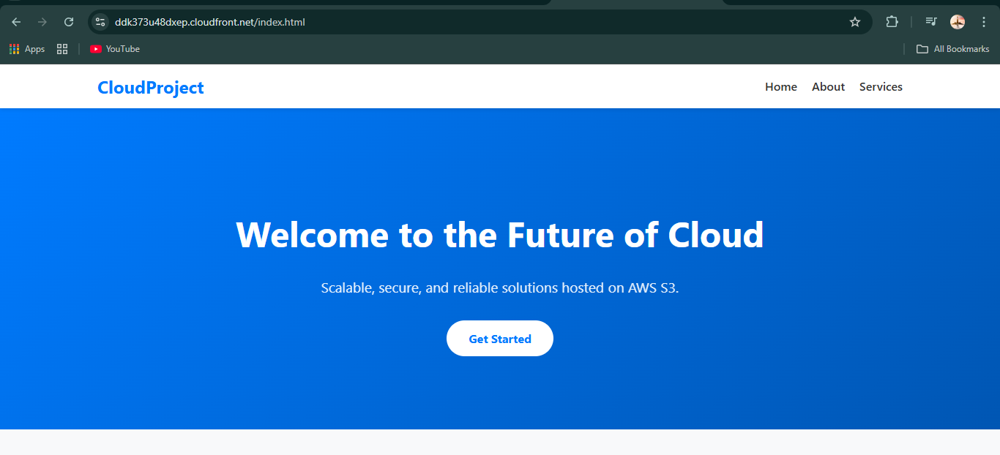

---

#  Final Result

- S3 bucket remained private
- Block Public Access remained enabled
- Website accessed securely via HTTPS
- CloudFront acted as the secure entry point
- No direct public access to S3

---

#  Key Lessons Learned

- S3 bucket names must be globally unique
- Block Public Access protects against accidental exposure
- CloudFront with OAC allows secure access to private buckets
- HTTPS enforcement improves security
- AWS Shield Standard provides automatic DDoS protection

---

## Final Architecture
